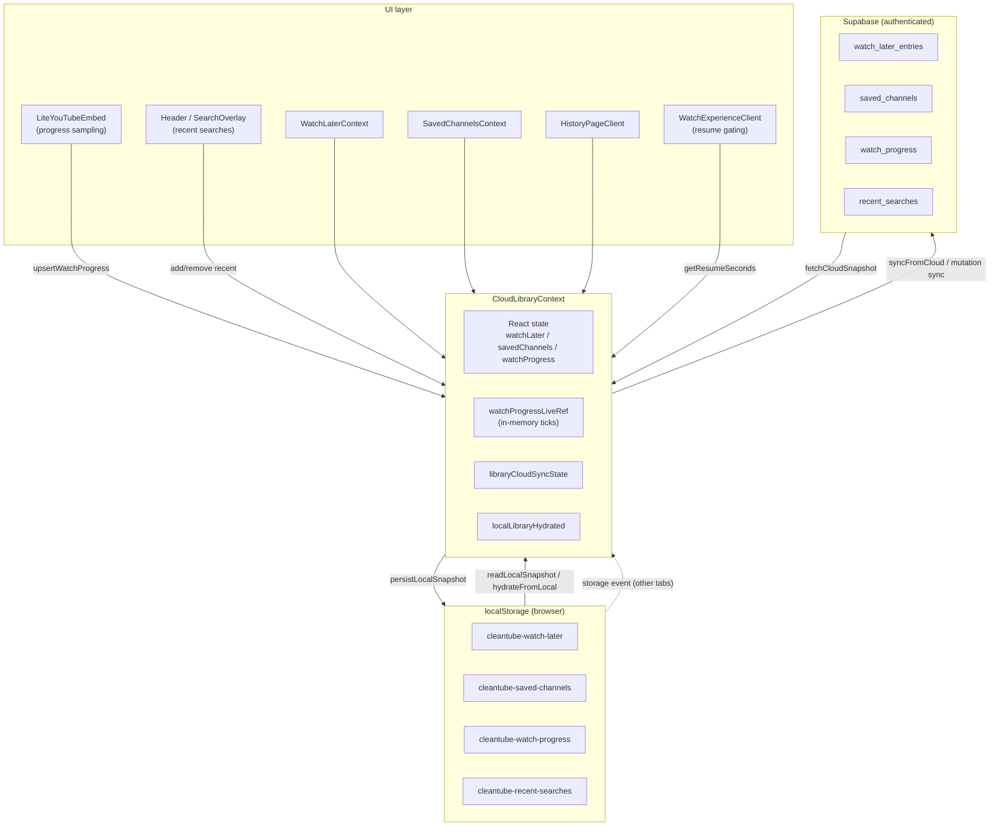

# Local-first library persistence (archived)

This document describes Cleantube’s **local-first library persistence** architecture: the system that let anonymous users keep Watch Later, saved channels, watch history/progress, and recent searches in `localStorage`, then optionally sync to Supabase after sign-in.

That model was **removed in favor of sign-in-only persistence** (cloud is the sole source of truth; anonymous users no longer accumulate durable library data). This file is an archive of how the old system worked so it can be understood, compared, or restored if needed.

---

## Overview

Cleantube treated the browser as the **primary store for anonymous sessions** and a **mirror + offline cache for signed-in sessions**. A single React context (`CloudLibraryProvider`) owned in-memory state, read/wrote four `localStorage` keys, and optionally synced to Supabase tables protected by RLS.

Design goals:

- **Works without an account** — library features usable immediately.
- **Sync on sign-in** — local snapshot uploaded or merged with cloud on first authenticated session.
- **Performance on iOS/Safari** — watch progress sampled every second in memory; disk and network writes throttled on separate cadences (see [Playback cadence](#playback-cadence)).
- **Privacy on sign-out** — local library keys cleared so the next anonymous session does not inherit another account’s data.

Related decision records:

- [`docs/decisions/watch-progress-persistence.md`](../decisions/watch-progress-persistence.md) — sampling vs persistence cadence, `watchProgressLiveRef`, deferred `localStorage` writes.
- [`docs/decisions/library-sync-merge.md`](../decisions/library-sync-merge.md) — merge follow-ups and future investigation (some items describe intended improvements beyond what `syncFromCloud` implemented at archive time).

---

## Architecture



**Provider placement:** `CloudLibraryProvider` wrapped the app in `src/app/layout.tsx`.

**Thin context wrappers:** `useWatchLater()` and `useSavedChannels()` delegated to `useCloudLibrary()` without adding persistence logic.

---

## localStorage keys

| Key | Constant | Content | Max / notes |
|-----|----------|---------|-------------|
| `cleantube-watch-later` | `WATCH_LATER_STORAGE_KEY` | JSON array of `WatchLaterEntry` | Unbounded in code |
| `cleantube-saved-channels` | `SAVED_CHANNELS_STORAGE_KEY` | JSON array of `SavedChannel` | Unbounded in code |
| `cleantube-watch-progress` | `WATCH_PROGRESS_STORAGE_KEY` | JSON array of `WatchProgressEntry` | Unbounded in code |
| `cleantube-recent-searches` | `RECENT_SEARCHES_STORAGE_KEY` | JSON array of query strings | 15 items (`RECENT_SEARCHES_MAX_ITEMS`) |

These four keys were the **library persistence surface**. Other `cleantube-*` keys (theme, scroll restore, watch layout, etc.) were unrelated to library sync.

### JSON shapes (client types)

**WatchLaterEntry** (`src/types/watchLater.ts`):

```ts
{
  entryId: string;
  videoId: string;
  title: string;
  thumbnailUrl: string;
  channelName: string;
  startSeconds?: number;  // optional resume offset when queued
  addedAt: string;        // ISO timestamp
}
```

**SavedChannel** (`src/types/savedChannel.ts`):

```ts
{
  id: string;
  name: string;
  channelId?: string;
  channelUrl?: string;
  thumbnailUrl?: string;
  searchQuery: string;
  entryKind?: "saved_channel" | "pinned_search";  // legacy rows inferred via effectiveSavedChannelKind
}
```

**WatchProgressEntry** (`src/types/watchProgress.ts`):

```ts
{
  videoId: string;
  title: string;
  thumbnailUrl: string;
  channelName: string;
  lastPositionSeconds: number;
  durationSeconds?: number;
  completed: boolean;
  everCompleted?: boolean;   // sticky after first completion; used for rewatch UX
  lastWatchedAt: string;     // ISO
  updatedAt: string;         // ISO; conflict tie-breaker
}
```

**Recent searches (local only):** `string[]` of raw queries. Cloud rows used `RecentSearchEntry { query, searchedAt }`; local lists were converted with synthetic timestamps via `localQueriesToEntries`.

### Parsing / validation

`src/lib/cloudLibrary/localStore.ts` parsed each key defensively: invalid JSON or malformed rows were dropped (empty array fallback). Watch progress required `lastWatchedAt` and `updatedAt`; numeric fields were floored and normalized.

---

## Supabase tables (cloud mirror)

| Table | Primary identity | Written by |
|-------|------------------|------------|
| `watch_later_entries` | `(user_id, video_id)` unique | `replaceWatchLaterEntries` (delete all for user, then upsert) |
| `saved_channels` | row `id` + unique indexes on `(user_id, lower(search_query))` and `(user_id, channel_id)` | `replaceSavedChannels` |
| `watch_progress` | `(user_id, video_id)` PK | `upsertWatchProgressEntries` / `replaceWatchProgressEntries` |
| `recent_searches` | `(user_id, lower(query))` unique | `replaceRecentSearches` (delete all, insert merged list) |

Schema migrations:

- `supabase/migrations/202604160001_cloud_library.sql`
- `supabase/migrations/202605210001_recent_searches.sql`
- `supabase/migrations/202605210002_watch_progress_ever_completed.sql`
- `supabase/migrations/202605130001_saved_channels_entry_kind.sql`

All tables used RLS: authenticated users could only read/write their own `user_id`. Anonymous clients never queried these tables.

---

## Data flow

### Boot / hydration

1. **`useLayoutEffect` (sync):** `readLocalSnapshot()` → populate React state → `localLibraryHydrated = true`.
2. **Auth init (async):** If Supabase configured, `getInitialSession()` then optionally `syncFromCloud(user)`.
3. **`storage` listener:** Cross-tab updates to any of the four keys triggered `hydrateFromLocal()` again.

`localLibraryHydrated` gated resume position on the watch page: `WatchExperienceClient` waited for hydration (and auth readiness when cloud configured) before calling `getResumeSeconds`, preventing a flash of `start=0` before local progress loaded.

### Anonymous behavior (`user == null`)

| Action | React state | localStorage | Supabase |
|--------|-------------|--------------|----------|
| Add/remove watch later | Updated | Immediate write | — |
| Add/update/remove saved channel | Updated | Immediate write | — |
| Upsert watch progress (lifecycle) | Updated | Immediate or deferred idle write | — |
| Upsert watch progress (10s tick) | Live ref only between commits | Deferred via `requestIdleCallback` | — |
| Recent search add/remove/clear | — | Immediate write (`getRecentSearches` reads local directly) | — |

`libraryCloudSyncState`: `"local_only"` when Supabase exists but user is signed out; `"unavailable"` when Supabase is not configured.

### Signed-in behavior (`user != null`)

Every library mutation followed **optimistic local-first** pattern:

1. Update React state.
2. `persistLocalSnapshot(...)` — write affected key(s) to `localStorage`.
3. If `supabase && user`, fire cloud write (await for list mutations; fire-and-forget for progress upserts).

**Watch progress while playing (signed-in):**

- 1s samples → memory only (`watchProgressLiveRef`, no React churn).
- 15s interval → `upsertWatchProgress` with `{ syncCloud: true }` (no periodic localStorage mirror).
- Pause / ended / tab hide / unmount → `{ persistLocal: true, syncCloud: true }` (local checkpoint + cloud).

After successful sign-in sync, `writeLocalLibraryMirror` wrote all three library keys to match the merged cloud snapshot.

### Cloud sync state machine

`LibraryCloudSyncState`:

| State | Meaning |
|-------|---------|
| `unavailable` | No Supabase client |
| `local_only` | Supabase configured, anonymous (or just signed out) |
| `syncing` | `syncFromCloud` in flight |
| `synced` | Last cloud fetch/merge succeeded; local mirror updated |
| `error` | JWT missing, fetch failure, or unhandled sync error |

On tab visible after 8s+ since sync start, `syncFromCloud` could re-run for recovery.

---

## Sign-in merge rules (`syncFromCloud`)

Executed on sign-in, initial session with user, and auth state change to authenticated. **Waited for a valid JWT** (`getSession` / `refreshSession`) before querying — otherwise RLS returned empty rows.

```
localSnapshot = readLocalSnapshot()
remote        = fetchCloudSnapshot(supabase)

cloudEmpty  = all three remote lists empty
localHasData = any local list non-empty
```

### Branch A — First cloud sync (`cloudEmpty && localHasData`)

Upload entire local snapshot to cloud:

- `replaceWatchLaterEntries(user, local.watchLater)`
- `replaceSavedChannels(user, local.savedChannels)`
- `replaceWatchProgressEntries(user, local.watchProgress)`

UI and `localStorage` kept the local data (now also in cloud).

### Branch B — Cloud already has data

| Domain | Merge rule at archive time |
|--------|---------------------------|
| **Watch Later** | **Remote wins** — `nextWatchLater = remote.watchLater` (local-only rows not merged in) |
| **Saved channels** | **Remote wins** — `nextSaved = remote.savedChannels` |
| **Watch progress** | **`mergeWatchProgressEntries(remote, local)`** — per `videoId`, newer `updatedAt` wins; tie-break with `lastWatchedAt`; `everCompleted` OR-merge |
| **Recent searches** | **`mergeRecentSearches(local, remote)`** — case-insensitive dedupe, keep newest `searchedAt`, cap 15; write local + `replaceRecentSearches` on cloud |

After branch B progress merge, any local row with `updatedAt` **newer than** the remote row for the same video was **upserted back to cloud** (`localAhead` filter).

> **Note vs decision doc:** [`library-sync-merge.md`](../decisions/library-sync-merge.md) describes additive merge for Watch Later and saved channels on sign-in. The archived `syncFromCloud` implementation still took **remote-only** lists for those two domains when the cloud was non-empty. Restoring additive merge would require changing branch B to use client-side merge helpers (similar to `mergeSavedChannels` in `sync.ts`) before cloud upsert.

### Sign-out

`signOutUser()`:

1. Supabase `signOut()`
2. `clearLocalLibraryStorage()` — remove watch-later, saved-channels, watch-progress keys
3. `clearLocalRecentSearches()`
4. `hydrateFromLocal()` — empty state
5. `libraryCloudSyncState = "local_only"`

Explicit wipe prevented anonymous sessions from reading the previous account’s mirrored library.

---

## Playback cadence

Constants in `src/components/LiteYouTubeEmbed.tsx`:

| Interval | Value | Behavior |
|----------|-------|----------|
| `PROGRESS_SAMPLE_INTERVAL_MS` | 1_000 ms | While playing: read player time; update in-memory progress only (via `upsertWatchProgress` default `persistLocal: false, syncCloud: false`) |
| `ANONYMOUS_LOCAL_PERSIST_INTERVAL_MS` | 10_000 ms | While playing, anonymous: `{ persistLocal: true }` |
| `SIGNED_IN_CLOUD_SYNC_INTERVAL_MS` | 15_000 ms | While playing, signed-in: `{ syncCloud: true }` |

**Immediate persist + cloud** on pause, ended, `beforeunload`, `pagehide`, `visibilitychange` (hidden), `freeze`, and component cleanup — always `{ force: true, persistLocal: true, syncCloud: true }`.

**Completion heuristic:** `completed = true` when `duration - currentTime <= 30` seconds.

**Iframe stability:** `useCommittedStartSeconds` locked the YouTube `start` param per video so progress saves did not remount the player mid-watch.

### Context-side progress optimizations (`CloudLibraryContext`)

- **`watchProgressLiveRef`:** Map of live patches merged in `getProgressByVideoId` / `getResumeSeconds` without re-rendering consumers every second.
- **`memoryOnly` path:** When both `persistLocal` and `syncCloud` are false and a row exists, only the ref updates.
- **Deferred disk writes:** Anonymous periodic persists used `scheduleDeferredWatchProgressDiskWrite` → `requestIdleCallback` (timeout 2s) or `setTimeout(0)` fallback; pause/flush paths cancelled idle work and wrote synchronously.
- **Cloud upserts:** Fire-and-forget `.catch(() => {})` — no await on the hot path.

**Resume derivation** (`deriveResumeSeconds` in `sync.ts`): If progress exists, not completed, and `lastPositionSeconds > 0`, use that; else fall back to watch-later `startSeconds`.

---

## Merge helpers (client)

| Function | File | Purpose |
|----------|------|---------|
| `mergeWatchProgressEntries` | `cloudStore.ts` | Sign-in progress merge; also used when comparing remote vs local timestamps |
| `mergeSavedChannels` | `sync.ts` | Dedupe by canonical aliases (`channelId`, normalized URL, search query, entry kind); used on **update** mutations, not sign-in branch B |
| `mergeRecentSearches` | `cloudRecentSearches/sync.ts` | Sign-in recent-search merge |
| `isInProgress` / `isRewatching` | `sync.ts` | UI filtering helpers |
| `deriveResumeSeconds` | `sync.ts` | Watch page start time |

Saved-channel alias keys used namespaces `ch:` vs `pin:` for `saved_channel` vs `pinned_search` kinds.

---

## Relevant file paths

### Core orchestration

| Path | Role |
|------|------|
| `src/context/CloudLibraryContext.tsx` | Single source of truth: state, hydration, sync, mutations, auth wiring |
| `src/app/layout.tsx` | Mounts `CloudLibraryProvider` |

### Local persistence

| Path | Role |
|------|------|
| `src/lib/cloudLibrary/localStore.ts` | Keys, parse/write snapshot, `clearLocalLibraryStorage` |
| `src/lib/cloudRecentSearches/localStore.ts` | Recent search key, add/remove/clear |

### Cloud persistence

| Path | Role |
|------|------|
| `src/lib/cloudLibrary/cloudStore.ts` | Supabase CRUD, auth helpers, `mergeWatchProgressEntries`, `fetchCloudSnapshot` |
| `src/lib/cloudRecentSearches/cloudStore.ts` | Fetch/replace recent searches |

### Sync / domain logic

| Path | Role |
|------|------|
| `src/lib/cloudLibrary/sync.ts` | Saved-channel merge, resume seconds, in-progress helpers |
| `src/lib/cloudRecentSearches/sync.ts` | Recent search merge, query ↔ entry conversion |
| `src/lib/cloudRecentSearches/types.ts` | `RecentSearchEntry`, max items |

### Types

| Path | Role |
|------|------|
| `src/types/watchLater.ts` | Watch later entry type |
| `src/types/savedChannel.ts` | Saved channel + `effectiveSavedChannelKind` |
| `src/types/watchProgress.ts` | Watch progress entry type |

### UI consumers

| Path | Role |
|------|------|
| `src/components/LiteYouTubeEmbed.tsx` | Playback sampling and persist cadence |
| `src/components/WatchExperienceClient.tsx` | Resume gating via `localLibraryHydrated` |
| `src/components/HistoryPageClient.tsx` | Watch history list |
| `src/components/Header.tsx` | `addRecentSearch` on submit |
| `src/components/SearchOverlay.tsx` | Recent search list UI |
| `src/context/WatchLaterContext.tsx` | Thin wrapper |
| `src/context/SavedChannelsContext.tsx` | Thin wrapper |
| `src/components/AccountMenu.tsx` | Sign-out (triggers local clear) |
| `src/app/(auth)/auth/AuthPageClient.tsx` | Sign-in/up |

### Auth extras (same provider, not library-local)

| Path | Role |
|------|------|
| `src/lib/cloudLibrary/mfaClient.ts` | MFA completion |
| `src/lib/cloudLibrary/webauthnClient.ts` | Passkeys |

### Decision / archive docs

| Path | Role |
|------|------|
| `docs/decisions/watch-progress-persistence.md` | Progress cadence rationale |
| `docs/decisions/library-sync-merge.md` | Merge follow-ups |
| `docs/archive/local-first-library-persistence.md` | This document |

---

## Public context API (persistence-relevant)

Exposed by `useCloudLibrary()`:

- **Hydration / sync:** `localLibraryHydrated`, `libraryCloudSyncState`, `authStatus`, `user`, `session`, `isCloudConfigured`
- **Lists:** `watchLaterEntries`, `savedChannels`, `watchProgress`, `inProgressEntries`
- **Mutations:** `addOrUpdateWatchLater`, `removeWatchLaterByVideoId`, `clearWatchLater`, `addSavedChannel`, `updateSavedChannel`, `removeSavedChannel`, `upsertWatchProgress(input, { persistLocal?, syncCloud? })`, `removeWatchProgressByVideoId`, `clearWatchProgress`
- **Reads:** `getProgressByVideoId`, `getResumeSeconds`, `isInWatchLater`, `getRecentSearches`, `addRecentSearch`, `removeRecentSearch`, `clearRecentSearches`
- **Auth:** `signIn`, `signUp`, `signOutUser`, passkey/MFA helpers

`WatchProgressUpsertOptions`:

- `persistLocal` (default `true`) — write watch-progress key
- `syncCloud` (default `true`) — upsert to Supabase when signed in

LiteYouTubeEmbed toggled these flags per cadence (see [Playback cadence](#playback-cadence)).

---

## How to restore local-first persistence

To re-enable the archived behavior after a sign-in-only migration, reintroduce the following concerns end-to-end.

### 1. localStorage layer

Restore or keep:

- `src/lib/cloudLibrary/localStore.ts` — all four export functions and keys
- `src/lib/cloudRecentSearches/localStore.ts`

Ensure mutations call `persistLocalSnapshot` / recent-search local helpers **before or alongside** cloud writes.

### 2. CloudLibraryContext behavior

Re-wire `CloudLibraryProvider` to:

- Hydrate from `readLocalSnapshot()` in `useLayoutEffect` and expose `localLibraryHydrated`
- Run `syncFromCloud` on sign-in with branch A/B merge rules above
- On every mutation: update state → local write → conditional cloud write
- On sign-out: `clearLocalLibraryStorage()` + `clearLocalRecentSearches()` + re-hydrate
- Listen for `storage` events on the four keys
- Implement `watchProgressLiveRef`, deferred disk queue, and `WatchProgressUpsertOptions` semantics
- Track `libraryCloudSyncState` through syncing/synced/error/local_only/unavailable

### 3. LiteYouTubeEmbed cadence

Restore the three timers and lifecycle flush handlers with:

- 1s memory sampling
- 10s anonymous `persistLocal`
- 15s signed-in `syncCloud`
- Full flush on pause/ended/hide/unload/unmount

### 4. Watch page resume gating

In `WatchExperienceClient`, restore `progressResolvable` logic that waits for `localLibraryHydrated` (and auth ready when cloud configured) before applying `getResumeSeconds`.

### 5. Sign-in merge logic

Restore in `syncFromCloud`:

- JWT wait before fetch
- Empty-cloud upload path
- Progress merge via `mergeWatchProgressEntries` + `localAhead` upserts
- Recent search merge via `mergeRecentSearches`
- `writeLocalLibraryMirror` after successful sync

Optionally implement the **additive** Watch Later / saved-channel merge described in `library-sync-merge.md` if product requirements exceed remote-wins branch B.

### 6. Supabase schema + RLS

Ensure migrations for `watch_later_entries`, `saved_channels`, `watch_progress`, `recent_searches` are applied and RLS policies allow authenticated CRUD on own rows.

### 7. UI expectations

- Anonymous users see library/history/recent searches populated from localStorage without signing in.
- Signed-in users see cloud-backed data with local mirror; cross-device via Supabase.
- Sign-out clears local library keys (users lose anonymous copy of signed-in data until they sign back in).

### 8. Tests / manual verification checklist

- [ ] Anonymous: save channel, watch later, watch video, search — data survives refresh
- [ ] Sign-in with empty cloud: local data appears in Supabase
- [ ] Sign-in with existing cloud: progress merges by `updatedAt`; understand WL/channels remote-wins behavior
- [ ] Sign-out: localStorage keys cleared; fresh anonymous session is empty
- [ ] Cross-tab: edit in one tab, other tab hydrates via `storage` event
- [ ] iOS: pause/hide flushes progress; no player remount from changing `start`
- [ ] Signed-in playback: cloud upsert ~15s, localStorage only on lifecycle events

---

## Summary

The local-first system made **`localStorage` the anonymous source of truth** and a **signed-in mirror**, with **`CloudLibraryContext`** coordinating hydration, throttled watch-progress writes, sign-in upload/merge, and sign-out wipe. **`LiteYouTubeEmbed`** owned playback sampling cadence; **`cloudLibrary/*`** and **`cloudRecentSearches/*`** split local parse/write from Supabase access. Removing local-first persistence means dropping anonymous durability, the four library keys, merge-on-sign-in, and the progress live-ref/deferred-write pipeline — restoring it requires bringing back that full stack, not just the localStore files.
