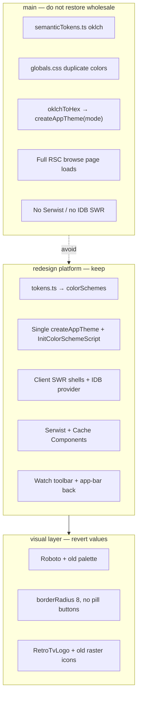

# Redesign branch — visual revert guide

This document records the split between **platform improvements** on the `redesign` branch and **visual rebranding** (typography, colors, border radii, logo, shell polish). Use it to experiment with restoring the pre-redesign look **without** losing PWA caching, client-side navigation, the MUI CSS-variables theme pipeline, or other beneficial changes.

**Do not reset `redesign` to `main`.** `main` still uses the old triple token pipeline (oklch in `semanticTokens.ts` + duplicate colors in `globals.css` + hex bridge in `createAppTheme(mode)`), full RSC page loads for browse routes, and no Serwist / IndexedDB SWR persistence. The goal here is a **skin revert on top of the new architecture**, not a branch rollback.

**Related docs**

- [Vercel Fluid / CPU performance revert guide](./vercel-fluid-cpu-performance-revert-guide.md) — server-side perf work (orthogonal to this visual revert)
- [Compact layout](./decisions/compact-layout.md) — iOS PWA layout bootstrap (keep in sync with `src/theme/breakpoints.ts`)

---

## Branch context

**Branch:** `redesign` (base: `main`)

**Commits on `redesign` since `main` (oldest → newest):**

| SHA | Summary | Category |
|-----|---------|----------|
| `17b8a62` | MUI CSS variables theme + refreshed UI | **Mixed** — keep architecture, revert visual half |
| `02c82e9` | Sea-glass palette + client channel/search SWR | **Mixed** — keep SWR/API, revert palette/logo/banners |
| `fb6876e` | Watch page client-side SWR | **Platform** |
| `afb5b6a` | Revisit skeletons, search overlay, auth autofill | **Platform** (logo preview is cosmetic) |
| `41fe70d` | Conditional passkey sign-in sheet | **Platform** |
| `2975d23` | For You auto-fetch when library ready | **Platform** |
| `068eba0` | Skeletons aligned to real layouts | **Platform** |
| `0ba1610` | Mobile/PWA watch player toolbar | **Platform** |
| `759f8b6` | IndexedDB SWR persistence | **Platform** |
| `743e465` | `use cache` migration | **Platform** |
| `0156e5f` | Serwist PWA + Cache Components | **Platform** |
| `7f26e3e` | Search overlay visual viewport on iOS | **Platform** |
| `99e1989` | Player toolbar revamp + first-tap navigation | **Platform** |
| `b18f1e3` | App bar back, player controls, smarter caching | **Platform** |

The original redesign plan intentionally sequenced work as **PR 1 = foundation (old colors OK)** then **PR 2+ = new visual language**. This guide implements that split after the fact.

---

## Architecture: what changed vs what to restore



---

## §1 — Always keep (platform)

These files and patterns are **not** part of the visual revert. Removing them regresses navigation, caching, or theme SSR.

### Theme infrastructure

| File | Role |
|------|------|
| `src/theme/tokens.ts` | **Structure** — `lightColorScheme` / `darkColorScheme`, `getThemeMetaColors()` |
| `src/theme/theme.ts` | **Structure** — `cssVariables`, `colorSchemes`, `ssrMatchMedia`, component override *pattern* |
| `src/theme/breakpoints.ts` | Centralized breakpoints for MUI + compact layout |
| `src/theme/layout.ts` | Channel rail width constants |
| `src/theme/mui-augmentation.d.ts` | `theme.vars` typings (`overlay`, `scrim`) |
| `src/lib/themeStorageManager.ts` | MUI `storageManager` → `cleantube-theme` cookie + localStorage |
| `src/app/providers.tsx` | Single theme memo, `useColorScheme`, SWR IDB provider wiring |

**Do not restore:** `src/theme/semanticTokens.ts`, `applySemanticCssVariables`, per-mode `createAppTheme(mode)`, or color blocks in `globals.css`.

### Client-side browse shells (instant navigation)

| File | Role |
|------|------|
| `src/components/HomeSearchResultsClient.tsx` | Search results via SWR |
| `src/app/(browse)/channel/[id]/ChannelPageClient.tsx` | Channel page via SWR |
| `src/app/(browse)/watch/[id]/WatchPageClient.tsx` | Watch shell + SWR video fetch |
| `src/hooks/useSearchResults.ts` | Search SWR hook |
| `src/hooks/useChannelPage.ts` | Channel SWR hook |
| `src/hooks/useWatchVideo.ts` | Watch SWR hook |
| `src/hooks/useSwrInitialLoad.ts` | IDB hydration gate |
| `src/app/api/search/route.ts` | Search API |
| `src/app/api/channel/[id]/route.ts` | Channel API |
| `src/app/api/videos/[id]/route.ts` | Watch video API |

### PWA and caching

| File | Role |
|------|------|
| `src/app/sw.ts` | Serwist service worker (ytimg SWR, API NetworkOnly) |
| `src/components/SerwistRegistration.tsx` | SW registration |
| `src/lib/swrIdbProvider.ts` | IndexedDB persistence for browse SWR keys |
| `src/lib/channelPageClientCache.ts` | Channel cache + IDB migration |
| `next.config.ts` | `cacheComponents`, Serwist webpack plugin |
| `src/app/RootLayoutDynamic.tsx` / `RootLayoutFallback.tsx` | Cache Components Suspense split |
| `src/app/~offline/page.tsx` | Offline fallback |

### Mobile / watch UX

| File | Role |
|------|------|
| `src/components/WatchPlayerToolbar.tsx` | On-page player controls (mute, captions, etc.) |
| `src/lib/youtubePlayerControls.ts` | YouTube iframe API helpers |
| `src/lib/watchPlayerToolbarPersistence.ts` | Toolbar show/hide persistence |
| `src/components/WatchHeaderBackButton.tsx` | App bar back on watch (mobile/PWA) |
| `src/hooks/useWatchBackTarget.ts` | Back navigation target resolution |
| `src/components/SearchOverlay.tsx` | Visual viewport sizing + scroll lock (keep logic, not sheet styling experiments) |

### SSR / hydration fixes (keep even if reverting colors)

- `theme.vars.palette.*` instead of `var(--color-base-*)`
- `theme.applyStyles('dark', …)` instead of `theme.palette.mode === 'dark'` in `sx` (avoids hydration flicker)
- `InitColorSchemeScript` with `colorSchemeSelector: '[data-theme="%s"]'` in layout

---

## §2 — Revert (visual rebranding)

### Typography

| Setting | `redesign` | Revert to (`main`) |
|---------|------------|---------------------|
| Font | Plus Jakarta Sans (`--font-plus-jakarta`) | Roboto (`--font-roboto`) |
| Scale | Full `h1`–`overline` scale in `theme.ts` | `fontFamily` only (Material defaults) |
| Button text | `fontWeight: 600`, custom letter-spacing | Default MUI button typography |

**Files:** `src/app/layout.tsx`, `src/theme/theme.ts`

### Colors

| Setting | `redesign` | Revert to (`main`) |
|---------|------------|---------------------|
| Primary | Sea-glass teal `#0E7C73` / `#5DD4CB` | Violet oklch (see mapping below) |
| Secondary | Warm terracotta `#B85C42` / `#D49A7A` | Magenta oklch |
| Surfaces | Warm sand `#F6F5F0` / charcoal `#141816` | Cool gray-white / blue-gray dark stack |

**Files:** `src/theme/tokens.ts` only (keep `getThemeMetaColors` helper). Manifest and viewport colors follow automatically.

### Shape and elevation

| Setting | `redesign` | Revert to (`main`) |
|---------|------------|---------------------|
| `shape.borderRadius` | `12` | `8` |
| `MuiButton` | Pill (`borderRadius: 9999`) | Remove override |
| `MuiCard` | `borderRadius: 12` + custom shadow array | Border only, default shadows |
| `MuiChip` / `MuiListItemButton` / `MuiIconButton` | Custom radii (8–10px) | Remove or match sparse `main` overrides |
| `MuiOutlinedInput` | `borderRadius: 8` | `var(--radius-field)` equivalent → `4px` / theme `8` |

**Files:** `src/theme/theme.ts`

### Logo and raster assets

| Setting | `redesign` | Revert to (`main`) |
|---------|------------|---------------------|
| Header mark | `CleanTubeLogo` (play + wave SVG) | `RetroTvLogo` (animated retro TV) |
| Settings preview | `LogoConceptsPreview` | Remove or hide |
| PWA / favicon | Regenerated sea-glass icons | Restore from `main` |

**Files:**

```
src/components/RetroTvLogo.tsx          # restore real component (not re-export alias)
src/components/CleanTubeLogo.tsx        # remove or deprecate
src/components/logo/CleanTubeLogoMark.tsx
src/components/LogoConceptsPreview.tsx
public/icon-192.png
public/icon-512.png
public/manifest.webmanifest             # colors auto-fix via tokens; name unchanged
scripts/app-icon-source.svg
scripts/generate-app-icons.mjs
src/app/favicon.ico
src/app/apple-icon.png
src/app/icon.png
```

### Layout polish (optional revert)

These are design choices bundled with the rebrand, not required for platform behavior:

| Change | File | Revert action |
|--------|------|---------------|
| Edge-to-edge channel banners | `src/app/(browse)/channel/[id]/ChannelBrowsePage.tsx` | Move banner back inside `Container`; restore `borderRadius: 3` |
| Header wordmark weight | `src/components/Header.tsx` | `fontWeight: 600` → `700` (cosmetic) |
| Bottom nav active pill / backdrop | `src/components/MobileBottomNav.tsx` | Restore `main` styling; re-apply any `theme.vars` migrations |
| Skeleton pill chips | `WatchPageClient.tsx` etc. | `borderRadius: 999` → match old skeleton shapes if desired |

---

## §3 — Palette mapping reference

Restore pre-redesign colors by updating **`src/theme/tokens.ts`** values. Map old Daisy-style tokens from `main:src/theme/semanticTokens.ts` into the new MUI `colorSchemes` shape:

| Old token (`main`) | New field (`tokens.ts`) |
|--------------------|-------------------------|
| `base100` | `palette.background.default` |
| `base200` | `palette.background.paper` |
| `baseContent` | `palette.text.primary` |
| `primary` / `primaryContent` | `palette.primary.main` / `contrastText` |
| `secondary` / `secondaryContent` | `palette.secondary.main` / `contrastText` |
| `info`, `success`, `warning`, `error` (+ `*Content`) | Same semantic keys under `palette` |
| `alpha(baseContent, 0.72)` | `palette.text.secondary` |
| `alpha(baseContent, 0.12)` | `palette.divider` |
| `alpha(primary, 0.08/0.16)` | `palette.action.hover` / `selected` |

**Reference oklch values from `main` (copy into tokens as hex or oklch):**

```
Light primary:   oklch(45% 0.24 277.023)   — violet
Light secondary: oklch(65% 0.241 354.308)  — magenta
Dark primary:    oklch(58% 0.233 277.117)
Dark secondary:  oklch(65% 0.241 354.308)
Light surfaces:  base100 oklch(100% 0 0), base200 oklch(98% 0 0)
Dark surfaces:   base100 oklch(25.33% 0.016 252.42), base200 oklch(23.26% 0.014 253.1)
Old radii:       selector/box 0.5rem (8px), field 0.25rem (4px)
```

**Quick way to grab old hex values** (if you prefer not to hand-convert oklch):

```bash
git show main:src/theme/semanticTokens.ts | rg "oklch|muiHexPaletteForMode" -A2
# Or inspect muiHexPaletteForMode output on main — those hex values fed createAppTheme(mode)
```

Keep `overlay` and `scrim` keys in `tokens.ts`; they are platform tokens for video card overlays, not part of the old brand palette.

---

## §4 — Suggested revert passes (reviewable chunks)

### Pass 1 — Theme skin only (~1 PR)

Goal: **behavior-identical**, old colors/type/radii.

1. Update `src/theme/tokens.ts` with pre-redesign palette values.
2. In `src/theme/theme.ts`: Roboto `fontFamily`, remove expanded typography scale, `shape.borderRadius: 8`, strip pill button / custom shadow overrides.
3. In `src/app/layout.tsx`: swap `Plus_Jakarta_Sans` → `Roboto` from `next/font/google`.
4. Run build + spot-check theme toggle and iOS cold load (no flash).

**Do not touch** SWR, Serwist, providers structure, or client shells in this pass.

### Pass 2 — Logo and icons (~1 PR)

1. Restore `RetroTvLogo.tsx` from `main` (real SVG component).
2. Point `Header.tsx` at `RetroTvLogo` — **keep** watch back button / grid layout if present.
3. Restore raster icons from `main`: `git checkout main -- public/icon-*.png src/app/favicon.ico src/app/apple-icon.png src/app/icon.png scripts/app-icon-source.svg`
4. Regenerate icons if needed: `node scripts/generate-app-icons.mjs`
5. Remove or hide `LogoConceptsPreview` in Settings.

### Pass 3 — Component cosmetic cleanup (~1 PR)

Review mixed files with:

```bash
git diff main...HEAD -- src/components/Header.tsx
git diff main...HEAD -- src/components/MobileBottomNav.tsx
git diff main...HEAD -- src/app/\(browse\)/channel/\[id\]/ChannelBrowsePage.tsx
```

For each file:

- **Keep** functional hunks (SWR, back nav, `theme.vars`, `applyStyles`).
- **Revert** spacing, radii, backdrop-filter, and layout polish hunks.

**Safe full checkout from `main`** (usually cosmetic-only — verify diff first):

```bash
git checkout main -- src/components/MobileBottomNav.tsx
# Re-apply theme.vars migrations if the redesign commit added them
```

---

## §5 — File cheat sheet

### Keep (platform) — do not revert

```
src/theme/breakpoints.ts
src/theme/layout.ts
src/theme/mui-augmentation.d.ts
src/lib/themeStorageManager.ts
src/lib/swrIdbProvider.ts
src/lib/youtubePlayerControls.ts
src/lib/watchPlayerToolbarPersistence.ts
src/hooks/useWatchVideo.ts
src/hooks/useSearchResults.ts
src/hooks/useSwrInitialLoad.ts
src/hooks/useWatchBackTarget.ts
src/app/sw.ts
src/components/SerwistRegistration.tsx
src/app/RootLayoutDynamic.tsx
src/app/RootLayoutFallback.tsx
src/components/HomeSearchResultsClient.tsx
src/app/(browse)/channel/[id]/ChannelPageClient.tsx
src/app/(browse)/watch/[id]/WatchPageClient.tsx
src/components/WatchPlayerToolbar.tsx
src/components/WatchHeaderBackButton.tsx
src/components/VideoCard.tsx
src/app/api/search/route.ts
src/app/api/channel/[id]/route.ts
src/app/api/videos/[id]/route.ts
```

### Revert values / assets (visual)

```
src/theme/tokens.ts
src/theme/theme.ts          # typography, shape, cosmetic component overrides
src/app/layout.tsx          # font import
public/icon-*.png
src/app/favicon.ico
src/app/apple-icon.png
src/app/icon.png
scripts/app-icon-source.svg
src/components/RetroTvLogo.tsx
src/components/CleanTubeLogo.tsx
src/components/logo/CleanTubeLogoMark.tsx
```

### Review case-by-case (mixed functional + cosmetic)

```
src/components/Header.tsx
src/components/AppShell.tsx
src/components/SearchOverlay.tsx
src/components/SearchResultsGrid.tsx
src/components/VideoResultsGrid.tsx
src/app/(browse)/channel/[id]/ChannelBrowsePage.tsx
src/components/SettingsPageClient.tsx
```

---

## §6 — Experimentation workflow

Work on a throwaway branch off `redesign`:

```bash
git checkout redesign
git checkout -b experiment/old-visual-skin

# Pass 1: restore old palette/type from main's semanticTokens (manual edit tokens.ts)
# Pass 2: restore logo/icons
git checkout main -- src/components/RetroTvLogo.tsx
git checkout main -- public/icon-192.png public/icon-512.png src/app/favicon.ico src/app/apple-icon.png src/app/icon.png

# Compare a mixed file before reverting wholesale
git diff main...HEAD -- src/components/Header.tsx
```

**Partial revert of a single commit's visual half:**

```bash
# Show only theme files changed in the big redesign commit
git show 17b8a62 --stat
git show 17b8a62 -- src/theme/theme.ts src/theme/tokens.ts src/app/layout.tsx

# Restore specific files from main, then re-apply cssVariables structure from redesign
git show redesign:src/theme/theme.ts > /tmp/redesign-theme.ts
git checkout main -- src/theme/theme.ts   # old look
# Manually merge cssVariables + colorSchemes from /tmp/redesign-theme.ts
```

---

## §7 — Common mistakes (do not do these)

| Mistake | Why it hurts |
|---------|--------------|
| `git reset --hard main` on `redesign` | Loses SWR shells, Serwist, IDB, player toolbar, back nav |
| Restore `semanticTokens.ts` + `globals.css` color blocks | Reintroduces triple pipeline drift |
| Restore per-mode `createAppTheme(mode)` | Breaks `useColorScheme` + `InitColorSchemeScript` contract |
| Revert watch/channel/search pages to full RSC | Kills instant client navigation |
| Remove `theme.vars` / `applyStyles` refactors | Brings back SSR theme flicker on cards |
| Remove Serwist or `swrIdbProvider` | Regresses PWA relaunch and offline thumbnail behavior |

---

## §8 — Verification after visual revert

Priority order (iOS PWA first, per project rules):

1. **iOS Safari / standalone PWA** — no theme flash on cold load; bottom nav safe-area; search overlay fits visual viewport.
2. **Theme toggle** — Settings persists light/dark via cookie + localStorage.
3. **Navigation** — search / channel / watch open from cache instantly; watch back button returns to origin.
4. **Visual parity** — palette matches `main` (violet primary, magenta secondary, Roboto, ~8px default radius).
5. **Build** — `npm run build` (webpack / Serwist) and `npm run lint`.

---

## §9 — Full visual revert (git nuclear option)

To restore **only** the theme files from `main` while staying on `redesign`, then manually re-merge `cssVariables`:

```bash
git checkout redesign
git checkout main -- src/theme/theme.ts   # WARNING: also removes cssVariables — merge required
```

Prefer the **three-pass approach** in §4 over a blind checkout. The merged end state should look like `main` visually with `redesign`'s `createTheme({ cssVariables, colorSchemes })` skeleton intact.

---

## §10 — Out of scope for this guide

- Server-side CPU / Fluid performance work — see [vercel-fluid-cpu-performance-revert-guide.md](./vercel-fluid-cpu-performance-revert-guide.md)
- Compact layout behavior — see [compact-layout.md](./decisions/compact-layout.md)
- New color palette chooser beyond light/dark (future product scope)
